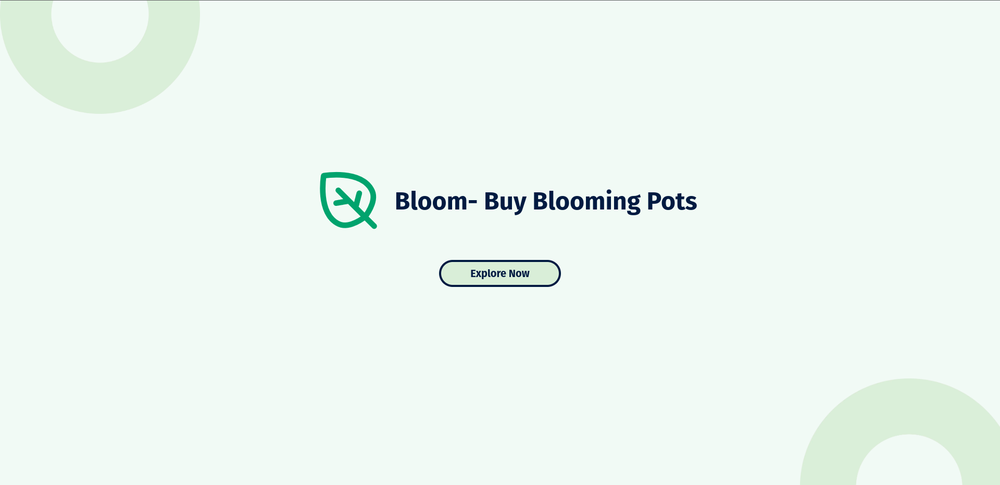
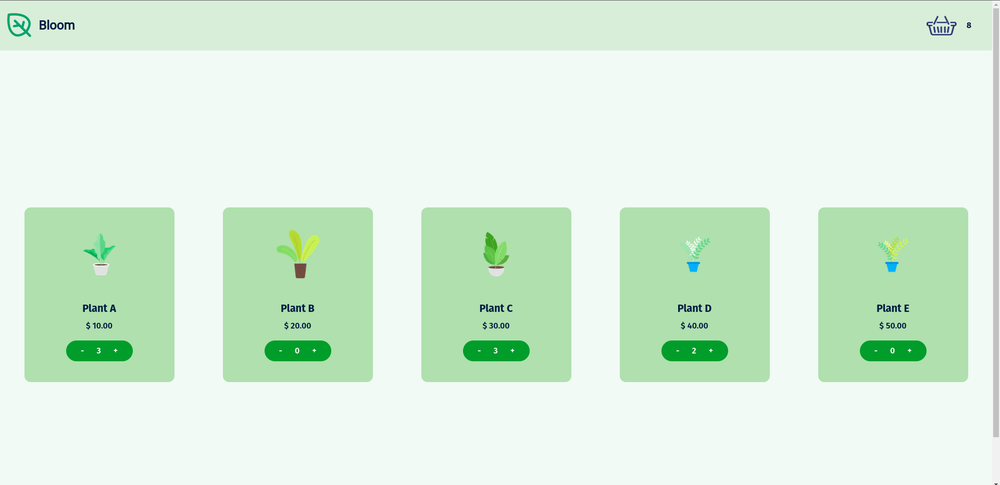
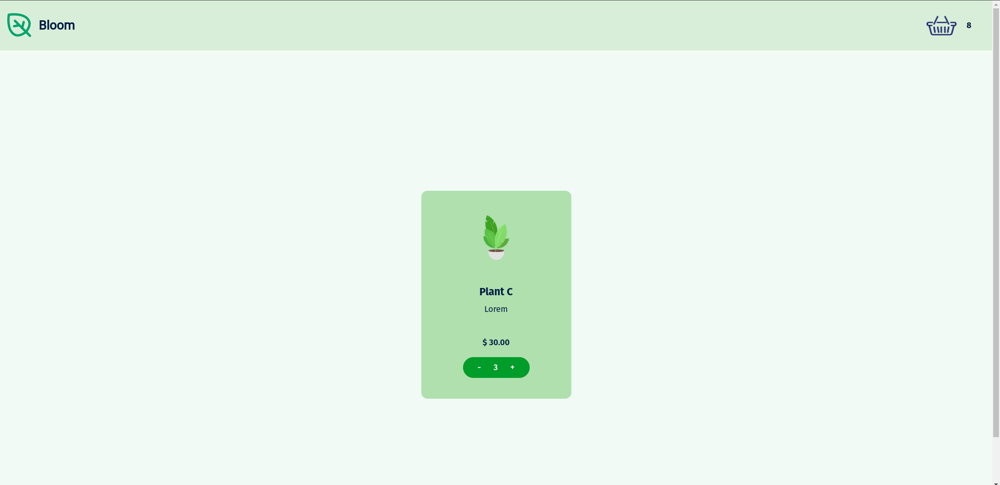
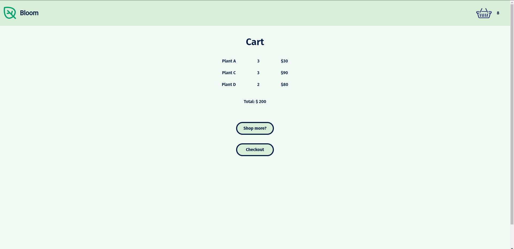
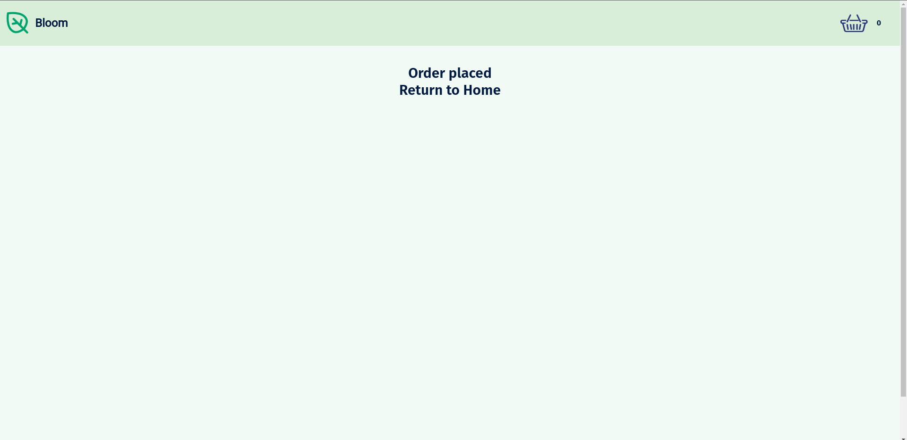

# Bloom - E-commerce Plant Shop

Bloom is a delightful and user-friendly e-commerce website that specializes in bringing nature's beauty into your home. With a focus on plants of all shapes and sizes, Bloom offers plant enthusiasts a diverse selection of greenery to enhance their living spaces.

# Key Features:

- **Landing Page:** Upon visiting Bloom, users are greeted with a visually appealing and inviting landing page. A lush and vibrant display of plants sets the tone for the entire shopping experience, making visitors feel like they've stepped into a botanical wonderland.

- **Product Carousel:** The heart of Bloom's website is the dynamic product carousel. This interactive feature showcases a curated selection of plants that continuously rotates, catching the eye and encouraging exploration. Users can scroll through the carousel to discover an array of plant varieties, each accompanied by captivating images and product details.

- **Dynamic Routes:** Clicking on a specific plant within the carousel seamlessly navigates users to dedicated product pages. Here, they can delve deeper into the unique characteristics, and pricing for each plant. The dynamic routing ensures a smooth and informative shopping journey.

- **Cart Page:** As users explore and select their favorite plants, the cart page provides a central hub for managing their purchases. Customers can easily review and their selections, view a summary of their order, and proceed to the checkout process with confidence.

Bloom is not just an e-commerce website, it's a virtual garden that cultivates a love for plants and fosters an enjoyable shopping experience. Whether you're a seasoned plant enthusiast or a newcomer to the world of indoor greenery, Bloom offers a place to find, learn about, and purchase the perfect plants for your home. Start your journey towards a greener and more vibrant living space with Bloom today!

## Demo

https://bloom-snowy.vercel.app/

## Screenshots







## Tech Stack

**Client:** Next.Js, Valtio, TailwindCSS

## Run Locally

Clone the project

```bash
  git clone https://github.com/tanmayagrwl/bloom.git
```

Go to the project directory

```bash
  cd bloom
```

Install dependencies

```bash
  npm install
```

Start the server

```bash
  npm run dev
```

## License

[MIT](https://choosealicense.com/licenses/mit/)

## Authors

- [@tanmayagrwl](https://www.github.com/tanmayagrwl)
